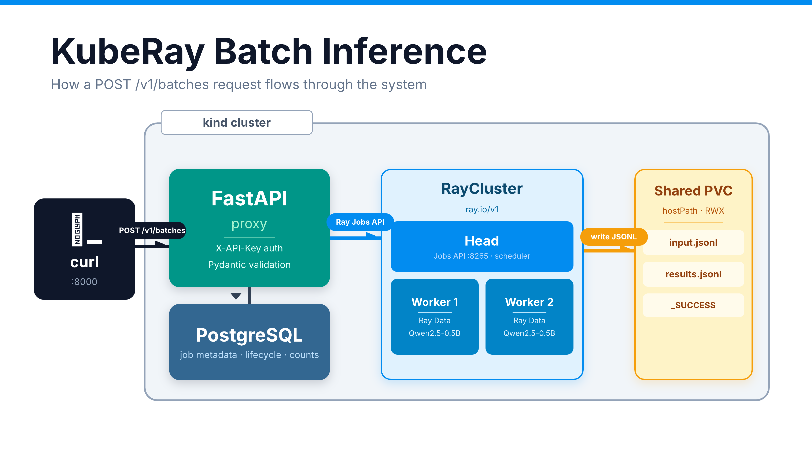
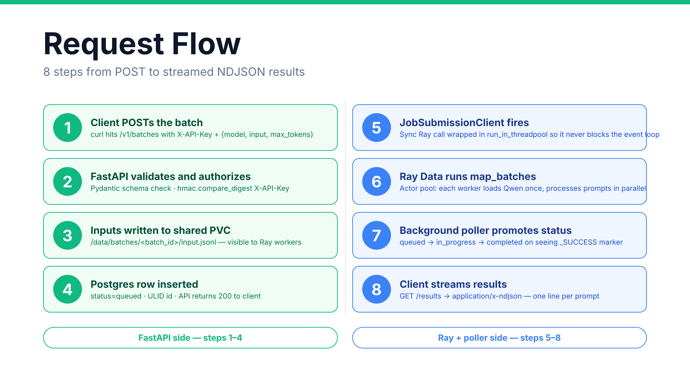
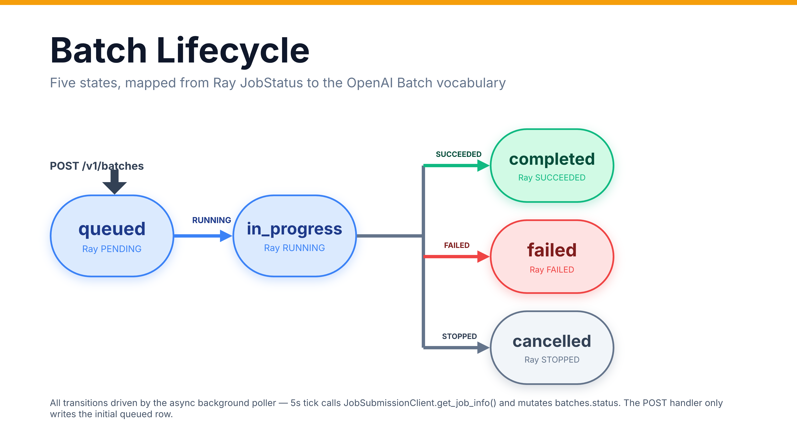

# KubeRay Batch Inference

[](https://github.com/Sebuliba-Adrian/kuberay-batch-inference/actions/workflows/ci.yaml)
[](api/tests)
[](docs/TECHNICAL_REPORT.md#3-evaluation-strategy-and-results)
[](.github/workflows/ci.yaml)
[](docs/TECHNICAL_REPORT.md#3-evaluation-strategy-and-results)
[](LICENSE)

[](api/pyproject.toml)
[](https://fastapi.tiangolo.com/)
[](https://docs.ray.io/)
[](https://github.com/ray-project/kuberay)
[](https://kubernetes.io/)
[](https://www.postgresql.org/)
[](api/Dockerfile)

Production-shaped reference implementation of a **distributed offline LLM batch inference service** built on [KubeRay](https://github.com/ray-project/kuberay), [Ray Data](https://docs.ray.io/en/latest/data/data.html), and [FastAPI](https://fastapi.tiangolo.com/). Target model: [`Qwen/Qwen2.5-0.5B-Instruct`](https://huggingface.co/Qwen/Qwen2.5-0.5B-Instruct).

The service exposes an OpenAI-shaped Batches API at `POST /v1/batches`, authenticates with a static `X-API-Key` header, submits distributed inference jobs to a long-running [`RayCluster`](https://docs.ray.io/en/latest/cluster/kubernetes/getting-started/raycluster-quick-start.html) via the [Ray Jobs API](https://docs.ray.io/en/latest/cluster/running-applications/job-submission/index.html), stores job metadata in PostgreSQL, and returns results as streamed `application/x-ndjson` read back from a shared PVC.

## Status

| What | State |
|---|---|
| **Tests** | 169 passing, 100% line + branch coverage on 464 statements / 78 branches |
| **CI** | Green on `ubuntu-22.04` runner (lint + typecheck + test + kubeconform + docker build) |
| **Runtime** | End-to-end verified on a real kind + KubeRay cluster — Ray Data pipeline producing real `Qwen2.5-0.5B` inference from the exact curl in the exercise PDF |
| **Spec compliance** | Ubuntu 22.04 requirement verified empirically by the CI runner on every commit |
| **TDD discipline** | Every line in `api/src/` driven by a failing test first. `--cov-fail-under=100` gate enforced in CI. |

## Quick Demo

```bash
# 1. One-shot bring-up: kind cluster + KubeRay + Ray cluster + Postgres + API
make up

# 2. Submit a batch (this is the exact call from the exercise PDF)
curl -X POST http://localhost:8000/v1/batches \
  -H "Content-Type: application/json" \
  -H "X-API-Key: $(cat .env | grep API_KEY | cut -d= -f2)" \
  -d '{
    "model": "Qwen/Qwen2.5-0.5B-Instruct",
    "input": [{"prompt": "What is 2+2?"}, {"prompt": "Hello world"}],
    "max_tokens": 50
  }'
# -> 200 OK
# {
#   "id": "batch_01JABCD...",
#   "object": "batch",
#   "endpoint": "/v1/batches",
#   "model": "Qwen/Qwen2.5-0.5B-Instruct",
#   "status": "queued",
#   "created_at": 1744380000,
#   "request_counts": {"total": 2, "completed": 0, "failed": 0}
# }

# 3. Poll status
curl http://localhost:8000/v1/batches/batch_01JABCD... \
  -H "X-API-Key: $API_KEY"

# 4. Stream results (newline-delimited JSON)
#
# Real outputs captured from the end-to-end run against the live kind +
# KubeRay + Qwen2.5-0.5B stack — not mocked, not hypothetical:
curl http://localhost:8000/v1/batches/batch_01JABCD.../results \
  -H "X-API-Key: $API_KEY"
# {"id":"0","prompt":"What is 2+2?","response":"The answer to 2 + 2 is 4. This is a simple addition problem...","finish_reason":"stop",...}
# {"id":"1","prompt":"Hello world","response":"Hello! How can I help you today?","finish_reason":"stop",...}

# 5. (Optional) Bring up Prometheus + Grafana for the Ray dashboard
#    time-series tab — only needed if you want live metrics panels
#    during the demo.
make monitoring-up     # installs into the `monitoring` namespace
make grafana           # port-forwards Grafana to localhost:3000 (admin/admin)
# Then refresh http://localhost:8265/#/metrics in the Ray dashboard
```

## Architecture



End-to-end topology inside a single kind cluster. The FastAPI proxy, Postgres, KubeRay-managed RayCluster, and optional Prometheus/Grafana sub-stack all share one PVC for batch JSONL.



Numbered steps along both sides of the split: green (FastAPI) handles auth, persistence, and job submission; blue (Ray) runs the distributed inference and writes results back to the shared PVC.



The five states of a Batch row, mapped to Ray `JobStatus`. All transitions are driven by the async background poller on a 5 s tick; the `POST` handler only writes the initial `queued` row.

See [`docs/ARCHITECTURE.md`](docs/ARCHITECTURE.md) for the decision log, trade-offs, and answers to the exercise's five key questions.

## Components

| Component | Path | Tech |
|---|---|---|
| FastAPI proxy | `api/` | Python 3.11, FastAPI 0.115, SQLAlchemy 2.0 async, pydantic-settings v2, uv |
| Ray inference job | `inference/` | Ray 2.54.1, Ray Data `map_batches`, HuggingFace Transformers, Qwen2.5-0.5B |
| Ray cluster | `k8s/raycluster/` | KubeRay v1.6.0 `RayCluster` CRD (`ray.io/v1`), CPU-only, 1 head + 2 workers |
| Local Kubernetes | `k8s/kind/` | kind v0.27.0, k8s 1.29.4, NodePort 30800 for host access via `extraPortMappings` |
| Storage | `k8s/postgres/`, `k8s/storage/` | Postgres 16, RWX PVC backed by kind `hostPath` + `extraMounts` |
| Monitoring (optional) | `k8s/monitoring/`, `scripts/install-monitoring.sh` | Prometheus + Grafana via Helm, scraping Ray metrics on `:8080`, Ray's default dashboards auto-provisioned |
| Scripts | `scripts/` | bash automation for Ubuntu 22.04 / 24.04 |
| CI | `.github/workflows/ci.yaml` | ruff + mypy + pytest (`--cov-fail-under=100`) + kubeconform + docker buildx on `ubuntu-22.04` |

## Documentation

- [`docs/ARCHITECTURE.md`](docs/ARCHITECTURE.md) — Decision log, architecture trade-offs, answers to the 5 key exercise questions
- [`docs/SETUP.md`](docs/SETUP.md) — End-to-end Ubuntu 22.04 setup from a fresh machine
- [`docs/API.md`](docs/API.md) — REST API reference with curl examples
- [`docs/TECHNICAL_REPORT.md`](docs/TECHNICAL_REPORT.md) — Full technical report (dataset analysis, method comparison, evaluation, production monitoring)
- [`docs/PRESENTATION.md`](docs/PRESENTATION.md) — Talk track for the 30-45 min demo

## Repository layout

```
kuberay-batch-inference/
├── README.md
├── LICENSE
├── Makefile                      # Single entry point for all ops
├── .env.example
├── .gitignore
├── .gitattributes                # LF line endings for shell, YAML, Dockerfile
├── docs/
│   ├── ARCHITECTURE.md           # Decision log, trade-offs, threat model
│   ├── SETUP.md                  # End-to-end Ubuntu walkthrough
│   ├── API.md                    # REST reference with curl examples
│   ├── TECHNICAL_REPORT.md       # 5-question deep dive + monitoring plan
│   └── PRESENTATION.md           # 30-45 min talk track
├── k8s/
│   ├── kind/kind-config.yaml     # single-node kind with extraPortMappings + extraMounts
│   ├── kuberay/values.yaml       # operator Helm values
│   ├── raycluster/raycluster.yaml  # RayCluster CRD + ServiceAccount + RBAC
│   ├── postgres/                 # deployment, service, pvc, secret, init-configmap
│   ├── storage/shared-pvc.yaml   # RWX PV+PVC backed by hostPath
│   └── api/                      # deployment, service, configmap, secret
├── api/
│   ├── Dockerfile                # Multi-stage build: uv venv → runtime, UID 10001
│   ├── pyproject.toml            # ruff, mypy, pytest config
│   ├── src/
│   │   ├── main.py               # FastAPI factory + lifespan wire-up
│   │   ├── config.py             # pydantic-settings (SecretStr API_KEY)
│   │   ├── auth.py               # X-API-Key dependency (hmac.compare_digest)
│   │   ├── models.py             # Pydantic v2 request/response schemas
│   │   ├── db.py                 # SQLAlchemy 2.0 async + Batch model
│   │   ├── ray_client.py         # Async wrapper around JobSubmissionClient
│   │   ├── storage.py            # JSONL read/write on shared PVC
│   │   ├── logging_config.py     # stdout formatter setup
│   │   └── routes/
│   │       ├── health.py         # /health liveness + /ready dependency probe
│   │       └── batches.py        # POST + GET status + GET results + poller
│   └── tests/                    # 15 test files, 169 cases, 100% line + branch
│       ├── conftest.py
│       ├── test_config.py
│       ├── test_auth.py
│       ├── test_models.py
│       ├── test_db.py
│       ├── test_storage.py
│       ├── test_ray_client.py
│       ├── test_main_health.py
│       ├── test_ready.py
│       ├── test_batches_post.py
│       ├── test_batches_get.py
│       ├── test_batches_results.py
│       ├── test_batches_internals.py
│       ├── test_status_poller.py
│       ├── test_lifespan.py
│       ├── test_e2e_happy_path.py
│       └── test_e2e_failure_paths.py
├── inference/
│   ├── Dockerfile                # Custom Ray worker: base + transformers + Qwen weights
│   ├── requirements.txt
│   └── jobs/
│       └── batch_infer.py        # Ray Data map_batches pipeline entrypoint
├── scripts/
│   ├── setup.sh                  # Fresh Ubuntu 22.04/24.04 → prereqs installed
│   ├── up.sh                     # Boot cluster + deploy everything (wraps make up)
│   ├── down.sh                   # Tear down stack (wraps make down)
│   └── smoke-test.sh             # The exact curl from the exercise PDF + auth checks
└── .github/
    └── workflows/
        └── ci.yaml               # runs-on: ubuntu-22.04 — lint + typecheck + test + kubeconform + docker
```

## License

MIT — see [`LICENSE`](LICENSE).
